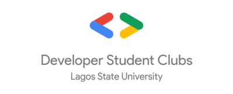
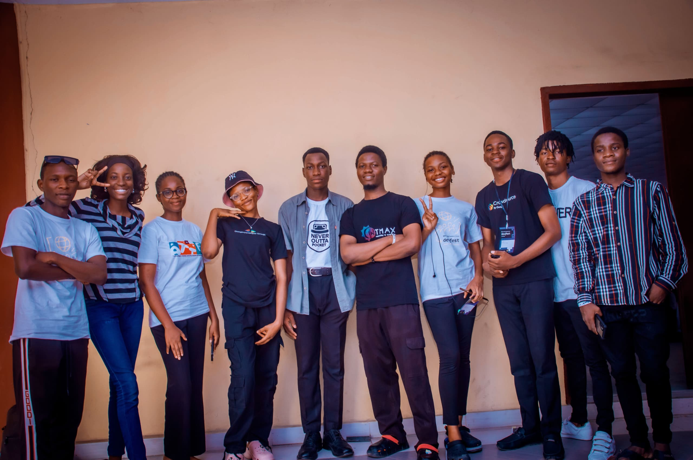
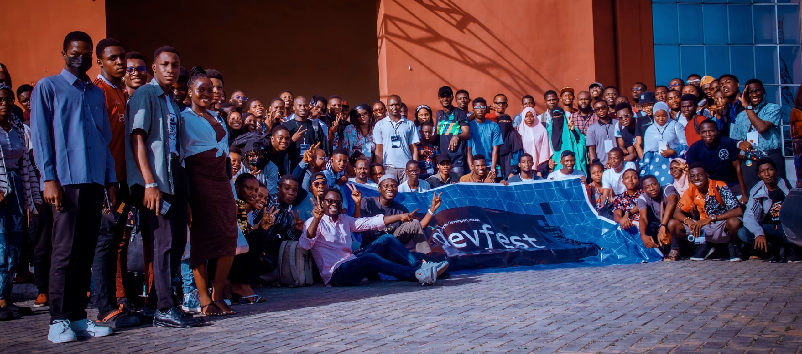

# Google Developer Student Clubs - Lagos State University

Welcome to the official GitHub repository of the Google Developer Student Clubs at Lagos State University. We're thrilled to have you here!

## Meet the Core Team (2023/2024)
The Core team is made of students passionate about Google's developer technologies and are willing to share their knowledge with others.
- They are the ones who make everything possible!
- They are the ones who make the magic happen!
- They are the ones who make the community what it is today!
- They are the dedicated students who work behind the door to make everything possible!

## About Us
We are a community of students from Lagos State University passionate about Google's developer technology; everything from Android, Web, to Google Cloud platforms.

Meet other students on campus interested in developer technologies. All are welcome, including those with diverse backgrounds and different majors.

## Our Mission
Bridging the gap between theory and practice by providing students with the opportunity to learn about Google technologies, different Tech tracks/fields in a collaborative environment.

## Our Vision
Providing students with the resources, opportunities, and support that will facilitate their growth as developers and leaders.

## Our Values
Our values are what drive us to achieve our mission and vision. They are the foundation of our community and the principles that guide our decisions.
- **Inclusivity**: Everyone should have the opportunity to learn and grow.
- **Collaboration**: We are stronger together than we are apart.
- **Diversity**: Our differences make us unique and that we can learn from each other.
- **Integrity**: Honesty and transparency are essential to building trust.
- **Respect**: Everyone deserves to be treated with dignity and respect.

## Our Goals
Our goals are what we hope to achieve in the next year. They are the milestones that will help us realize our mission and vision.
- **Build a community**: A community of students passionate about Google's developer technologies.
- **Host events**: Events that will help students learn about Google's developer technologies and go beyond the boundary of code and no-code tools.
- **Create projects**: Projects that will help students apply what they've learned in a practical way.
- **Collaborate with others**: Collaborating with other communities to create a more inclusive environment.
- **Grow our community**: Growing our community by reaching out to more students and getting them involved.

## Our Projects
Our projects are what we're currently working on. They are the initiatives that will help us achieve our goals and realize our mission and vision.

## Our Github Stats

## Join Us
New members are always welcome! Click the links below to join our community:
- [Join our WhatsApp Group](https://chat.whatsapp.com/KiGTFlGEeNcCXDmGaS4O1p)
- [Join our GDSC Community](https://gdsc.community.dev/lagos-state-university/)

We really cannot wait to have you on board 🤗

## Get Involved
There are many ways to get involved with our community:
- Attend our events and workshops
- Contribute to our projects
- Share your ideas and help us improve

## Contact Us
If you have any questions or suggestions, feel free to reach out to us. We're always happy to hear from you!

## Follow Us
Stay updated with our latest news and events:
- [Twitter](https://twitter.com/gdsclasu)
- [Linkedin](https://linkedin.com/in/gdsclasu)
- [Email](mailto:lasugdsc@gmail.com)

## License
This project is licensed under the terms of the MIT license.

